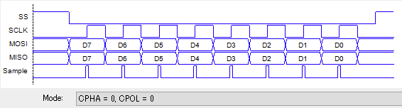
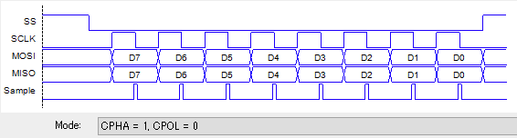
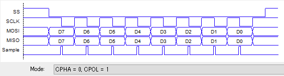
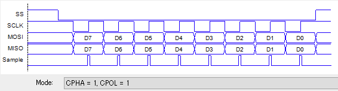

# SPI

- SPI バスをサポートするクラス。
- この仕様書ではマスターデバイス、8bit 単位の転送のみ規定する。
- チップセレクト SS はGPIO機能を使う事とし、SPIクラスでは規定しない。

---

## コンストラクタ


### SPI.new( id=nil, *params )

- id で示す物理ユニットを指定して、SPI オブジェクトを生成する。
- 物理ユニットが１つしか無い場合などは、idは省略可能とする。

オプションパラメータ

| param | type | description |
| --- | --- | --- |
| unit | --- | SPIユニットの指定 |
| frequency | Integer | 周波数 (default 1MHz) |
| mode | Integer | 0 to 3 (default 0) |
| first_bit | Constant | SPI::MSB_FIRST or SPI::LSB_FIRST (default MSB_FIRST) |

使用例

```ruby
# デフォルトの設定で、spiオブジェクトを生成する。
spi = SPI.new()

# ユニット1 の SPI デバイスを、周波数 10MHz で使う。
spi = SPI.new( unit:1, frequency:10_000_000 )
```

モードパラメータ

| mode | CPOL | CPHA | Idle state clock polarity | Sampling timing | |
|:----:|:----:|:----:|:-------------------------:|:---------------:|-|
|   0  |  0   |  0   | Low                       |   Rising edge   ||
|   1  |  0   |  1   | Low                       |  Falling edge   ||
|   2  |  1   |  0   | High                      |  Falling edge   ||
|   3  |  1   |  1   | High                      |   Rising edge   ||


機種依存

- 全てのパラメータがサポートされているとは限らない。

---

## インスタンスメソッド


### setmode( *params )

- SPI の動作モード（パラメータ）を変更する。
- パラメータの指定は、コンストラクタに準拠する。

使用例

```ruby
spi.setmode( mode:3 )
```

---

### read( read_bytes ) -> String

- SPIバスから read_bytes バイトのデータを読み込む。
- 同時に出力されるデータは、0が出力される。

使用例

```ruby
data = spi.read( 32 )
```

---

### write( *outputs ) -> nil

- SPIバスへ、outputs で指定したデータを出力する。
- outputsは、Integer, Array\<Integer\> もしくは String で指定する。

使用例

```ruby
spi.write( 0x30, 0xa2 )
spi.write( "\x30\xa2" )
spi.write( 0x02, 0xee, 0xad, 0x00, data_string )  # useful for EEPROM
```

---

### transfer( outputs, additional_read_bytes = 0 ) -> String

- SPIバスへ outputs で指定したデータを出力しながら同時に入力する（汎用転送）
- outputs は、Integer, Array\<Integer\> もしくは String で指定する。
- additional_read_bytes を指定すると、そのバイト数分の 0x00 を output に続いて出力する。

使用例

```ruby
s = spi.transfer( 0b0000_0101, 1 )  # s は 2バイトの String が返る
```
